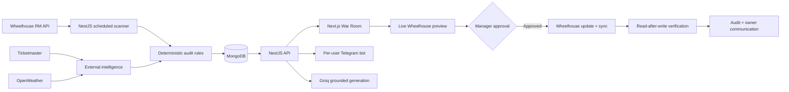

# Kivora architecture

## Trust boundaries

- Wheelhouse, Groq, MongoDB, Telegram, Ticketmaster, and OpenWeather credentials stay in NestJS.
- Next.js receives only the public API URL and Privy app ID.
- Privy bearer tokens are verified by the official server SDK with `PRIVY_APP_ID` and `PRIVY_APP_SECRET`; no separate verification key is used.
- Reads and non-mutating Wheelhouse previews require an authenticated Privy user. Mutations require a manager/admin session or the server-only approval token.
- Kivora verifies supported preference changes after writing them and stores the before/after values in MongoDB.
- Operational incidents without a safe automated resolution are marked for manual review and cannot enter a pricing-write path.
- Telegram connection intents are HMAC-signed, expire after ten minutes, are single-use, and bind both the Telegram chat and sender to one Privy-backed Kivora user.

## Reliability

The default scan processes at most ten listings per pass. Five Wheelhouse reads per listing plus listing pagination stays under the documented 60-request/minute limit. Scans rotate through larger portfolios, retry transient 409/423/429 responses with bounded exponential backoff, isolate optional external-provider failures, deduplicate incident alerts, and never return mock data.
