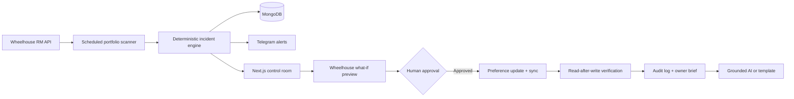

# Kivora architecture

Wheelhouse credentials remain server-side. What-if analysis calls Wheelhouse's live, non-mutating preview endpoint. Write operations require explicit approval through a verified Privy manager or `KIVORA_APPROVAL_TOKEN`, then a read-after-write verification. Telegram `/start` creates a signed, expiring intent; after Privy login it is consumed once and the Telegram chat is stored against that user in MongoDB. Chat IDs are never global environment configuration.
